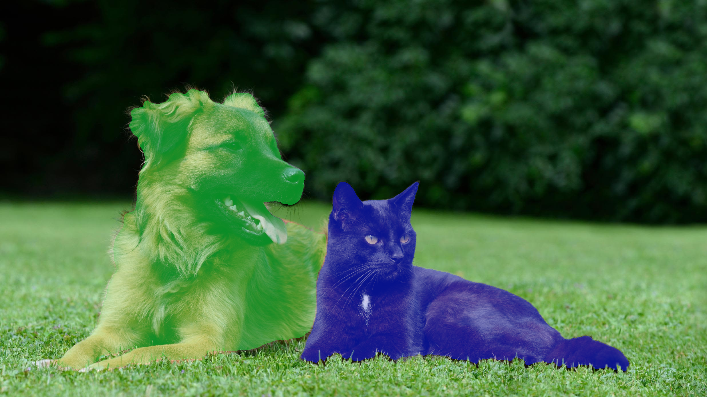
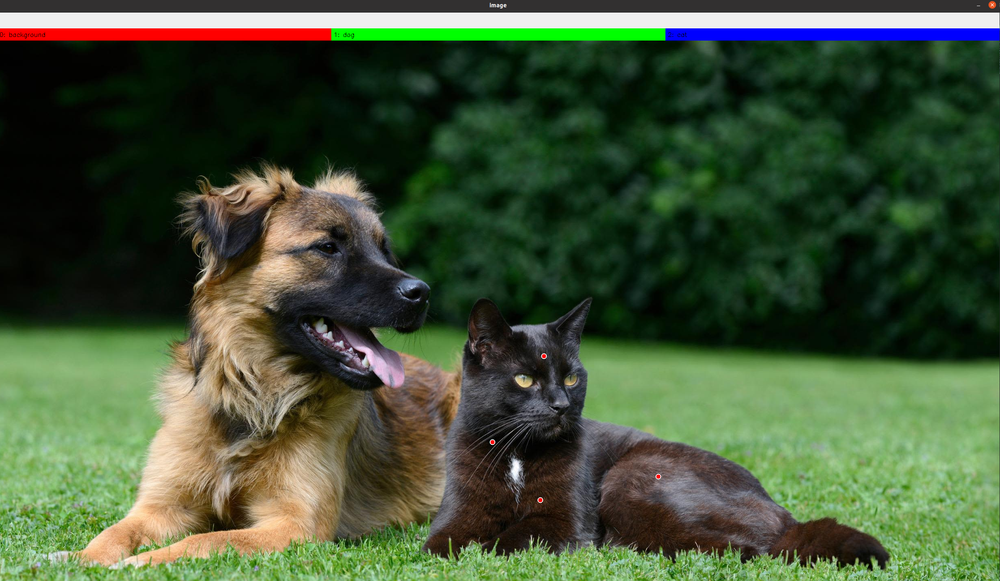
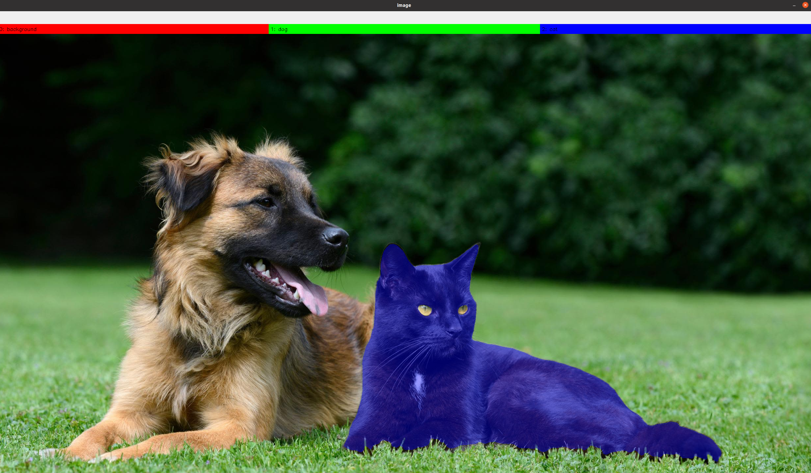
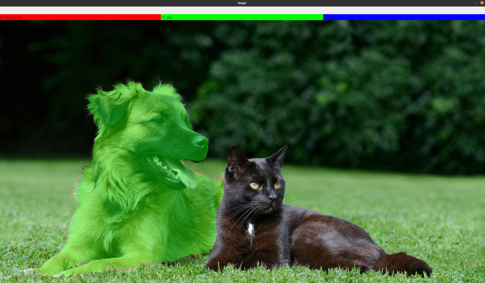
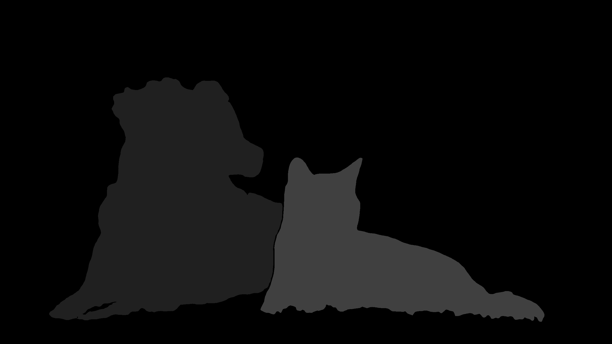

# SEMI-AUTOMATIC LABELLING TOOL FOR SEMANTIC SEGMENTATION

This is a tool to label images with the support of Segment Anything Model (SAM). The tool has been developed in collaboration with [leobarcellona](https://github.com/leobarcellona).



## INSTALLATION

```bash
git clone https://github.com/bach05/SAM_annotation_tool.git
cd SAM_annotation_tool/
pip install -r requirements.txt 
```
Download the `sam_vit_l_0b3195.pth` weights from [official repository](https://github.com/facebookresearch/segment-anything) and place it into 'SAM_annotation_tool/
' folder. 
Put the images you want to label into `data` folder. 

## USAGE

```bash
python3 label_with_SAM.py
```

The GUI will show up. In the terminal you can have a feedback on the current action. 


### 1. Label
To start labelling, click on the target label in the upper part of the GUI.

- With **LEFT** mouse click you can add **POSITIVE POINTS** (red), i.e. suggest where the target object is. 
- With **RIGHT** mouse click you can add **NEGATIVE POINTS** (blue), i.e. suggest where the target object is not. 



### 2. Preview
By pressing `s`, you can preview the current labelled mask in the image. 


### 3. Correct
If you are not satisfied, you can add more positive and negative points to refine the mask. 


Pressing `s` again you can update the preview. Repeat steps 2,3 until you are satisfied. 



### 4. Add more objects
If you want to add a new object with a different label, press `a` and repeat steps 1,2,3 until you are satisfied.




### 5. Save data
When you label all the objects, press `q`. A quick preview of the annotation will show up and the data will be saved in the output folder. 

If you don't label anything, nothing will be saved. It is equivalent to skip the image. 




When last image has been processed, the scripts ends. You can quit anytime with `CTRL+C` on the terminal. 
